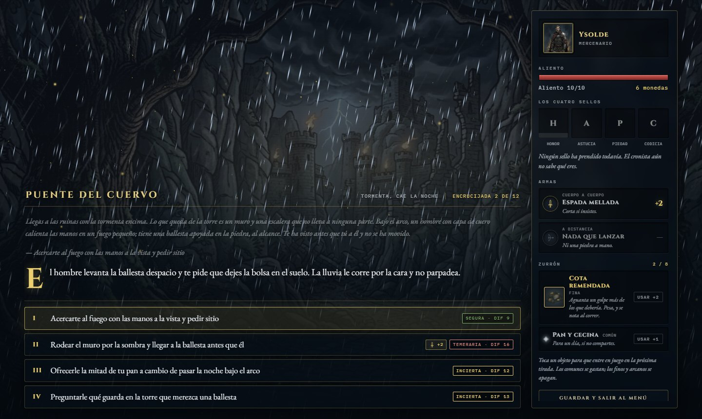
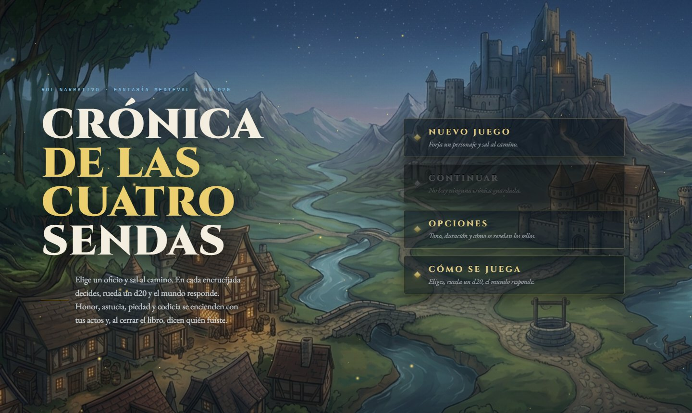
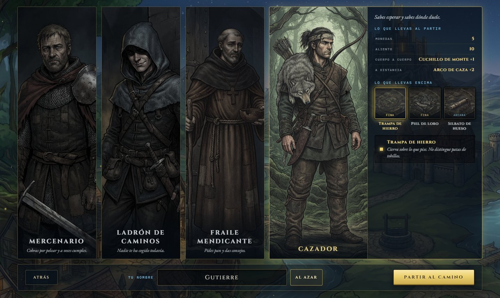
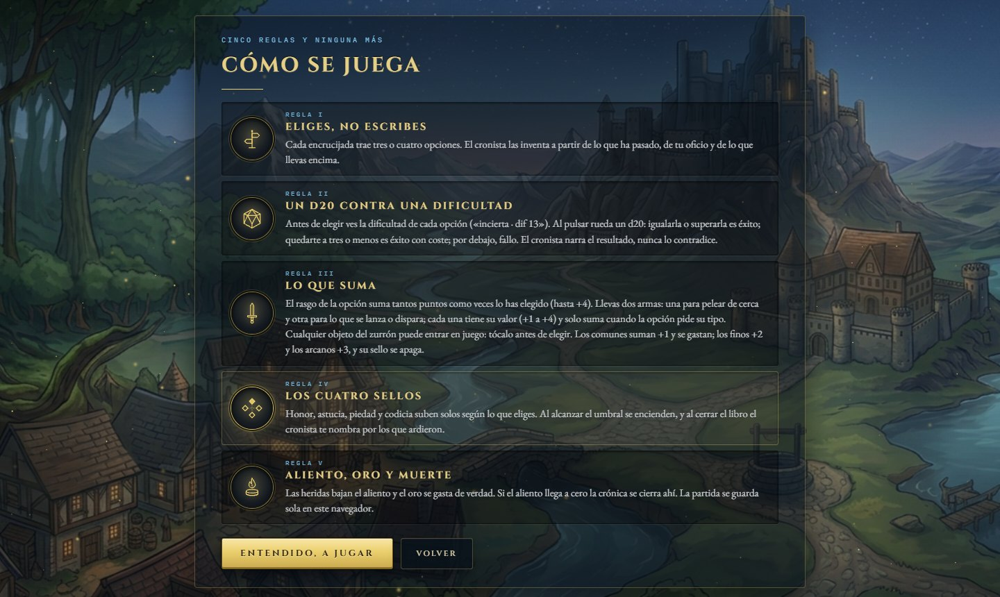
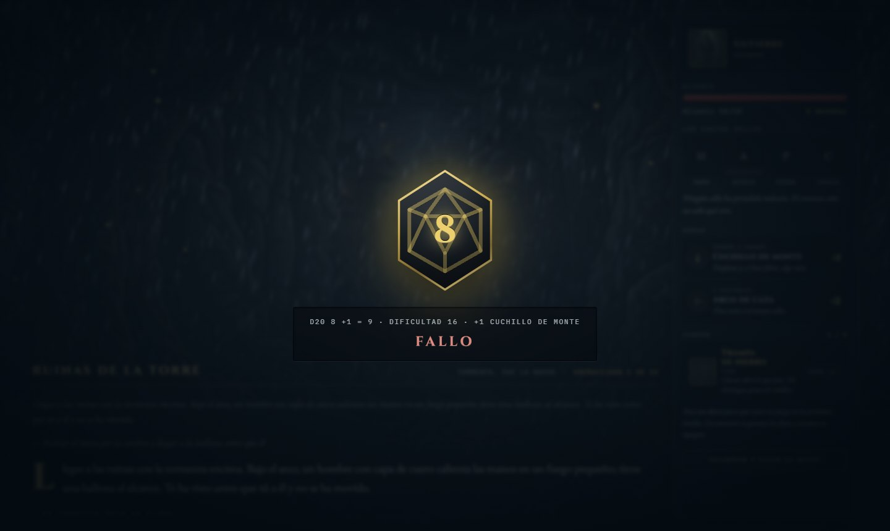

# Crónica de las Cuatro Sendas

Juego de rol de fantasía medieval narrado por una IA. Eliges entre tres o cuatro opciones, rueda un d20 contra una dificultad y el cronista escribe lo que pasa. Honor, astucia, piedad y codicia suben solos según lo que eliges y, al cerrar el libro, dicen quién eras.



## Pantallas

| Menú principal                                 | Creador de personaje                                                        |
| ----------------------------------------------- | --------------------------------------------------------------------------- |
|  |  |

| Cómo se juega                                       | La tirada                                           |
| ---------------------------------------------------- | --------------------------------------------------- |
|  |  |

## Arrancar

```bash
pnpm install
cp .env.example .env.local   # y rellena VITE_ANTHROPIC_API_KEY
pnpm dev
```

Sin clave, el menú, las opciones, las reglas y la creación de personaje funcionan igual, pero al partir al camino el cronista avisa de que no puede escribir.

Si el juego se ejecuta dentro del visor de Claude (`window.claude.complete` disponible), usa ese canal y no necesita clave.

> La clave de API se incrusta en el bundle del navegador. Vale para jugar en local; para publicar, cambia `completar` en `src/juego/cronista.js` por una petición a un backend propio que guarde la clave.

## Estructura

```
src/
  App.jsx                 raíz: fondo, cabecera, pantalla según la fase y el dado
  App.css / index.css     estilos (clases; el original usaba estilos inline)
  piedra.css              paneles de cristal oscuro con filo dorado, placas, medallones y botones
                          (conserva las texturas de piedra en SVG, ya sin uso)
  juego/
    datos.js              rasgos, oficios, tonos, reglas, esquema JSON del cronista
    derivados.js          cálculos puros a partir del estado (sellos, umbral, largo…)
    fondos.js             banco de fondos por escena con búsqueda del más parecido
    cronista.js           prompt de cada encrucijada y llamada al modelo
    useCronica.js         hook con toda la lógica de partida, el guardado local y las preferencias
    musica.js             música ambiental generada con Web Audio (sin archivos de audio)
    ambiente.js           sonido de escena (viento, lluvia, truenos, grillos, pájaros) con Web Audio
    imagenes.js           retratos e ilustraciones de objetos por nombre
  componentes/
    Retrato.jsx           retrato de oficio en marco de piedra, con fundido y marcador
    FondoFX.jsx           pavesas, niebla y clima (lluvia, nieve, polvo, relámpagos) en shaders
    Fondo.jsx             fondo de escena con fundido, paralaje y pulso de luz
    Aves.jsx              bandadas cruzando el cielo de día
    Dado.jsx              velo del d20
    Iconos.jsx            iconos SVG de las reglas
  pantallas/
    Menu (+ Menu.css, losas de piedra), Reglas, Opciones y Fin (tablillas con placas),
    Personaje (+ Personaje.css, paneles de oficio en acordeón), Carga,
    Juego (+ Juego.css, paisaje a pantalla completa, crónica flotante y ficha traslúcida)
```

## Personaje

El creador es una pantalla de selección con **cuatro paneles a lo alto**, uno por oficio, con su retrato ilustrado (`src/assets/personajes/<clave>.jpg`). El elegido se ensancha en acordeón y despliega su ficha: frase, dotación inicial, las tres losetas de objeto y la descripción del elegido. El nombre y los botones van en una banda de piedra abajo. En la partida, el retrato aparece recortado a busto en el panel lateral. Si hay **variantes** (`<clave>-2.jpg`, `<clave>-3.jpg`…), el creador muestra flechas y puntos para elegir entre ellas, y la elegida viaja con la partida. Las miniaturas de la lista de oficios y las losetas de objeto usan las mismas imágenes. El nombre se puede escribir o sacar **al azar** de una lista de nombres masculinos castellanos medievales (`NOMBRES` en `src/juego/datos.js`). Los objetos iniciales tienen su **ilustración** (`src/assets/objetos/<nombre-en-minusculas>.jpg`), usada en las tarjetas del creador y en el zurrón. Si falta una imagen, aparece un marcador de piedra con el icono del oficio o el rombo de rareza; basta con soltar el archivo en su carpeta. Listas con nombres, formato y prompts en `src/assets/personajes/LISTA.md` y `src/assets/objetos/LISTA.md`.

## Armas

Cada arma puede llevar **ilustración** (`src/assets/armas/`): por nombre exacto o por palabra clave para las que inventa el cronista ("Hacha de leñador" usa `hacha.jpg`). Lista y prompts en `src/assets/armas/LISTA.md`. Dos ranuras: **cuerpo a cuerpo** y **a distancia**. Cada arma tiene un bono de +1 a +4 según lo buena que sea (1 improvisada o gastada, 2 arma corriente, 3 fina, 4 excepcional) y solo suma cuando la opción elegida pide su tipo; el cronista etiqueta cada opción con `combate: cuerpo | distancia | ninguno` y la interfaz lo muestra con un icono de espada o arco. Coger un arma nueva sustituye a la de su ranura; perderla, romperla o entregarla la vacía (`quitar_arma: cuerpo | distancia` en los efectos). El prompt exige que todo cambio de inventario, dinero o salud que cuente la prosa aparezca en `efectos`, y el cliente elimina objetos por nombre sin distinguir mayúsculas ni tildes. Las armas iniciales están en `OFICIOS` (`armas: [...]`) y las reglas de normalización en `normalizarArma` de `src/juego/derivados.js`.

## La pantalla de partida

La ilustración de la escena ocupa toda la pantalla. La crónica flota abajo a la izquierda sobre un degradado que va de transparente a opaco, así el cielo y el horizonte quedan limpios; el registro queda anclado al párrafo más reciente y los anteriores se desvanecen por arriba. La ficha del personaje es un panel traslúcido con desenfoque a la derecha. Todas las pantallas comparten el mismo lenguaje: paneles de cristal oscuro con filo dorado sobre el paisaje, que siempre está vivo (paralaje, pulso de luz, pavesas).

El ambiente responde a la escena que devuelve el cronista (`terreno`, `cielo`):

- **Fondo**: imagen de `src/assets/fondos/<terreno>-<cielo>.jpg` (o la más parecida), con fundido de 1,6 s al cambiar, **paralaje suave con el ratón** y un **pulso cálido de luz** sobre el horizonte. Lista y prompts en `src/assets/fondos/LISTA.md`.
- **Luz**: gradación de color y tinte por cielo (amanecer, día, atardecer, noche, tormenta, niebla).
- **Clima en WebGL** (`FondoFX`): lluvia con relámpagos en tormenta, nieve en terreno nevado, polvo en yermo y arena, niebla densa en escenas de niebla, pavesas siempre.
- **Aves** cruzando el cielo en escenas de día (`Aves`).
- **Sonido de ambiente** generado con Web Audio (`src/juego/ambiente.js`): viento según el terreno, lluvia y truenos en tormenta, grillos de noche, pájaros de día en bosque y campo. Cada capa se funde en 1,6 s. Se apaga en Opciones.

## Zurrón

Hasta 8 objetos, listados con nombre, rareza y nota. Cualquiera puede **entrar en juego** tocándolo antes de elegir una opción: los comunes suman +1 y se gastan; los finos +2 y los arcanos +3, y después su sello queda apagado (una sola vez). Bonos en `BONO_OBJETO` (`src/juego/datos.js`).

## Opciones de partida

- **Música**: bordón grave y notas de arpa generados en el navegador. Para usar una pista propia, sustituye `src/juego/musica.js` por un `<audio loop>`.
- **Dificultad**: Clemente (12 de aliento, tiradas −2), Justa (10, sin ajuste) o Cruel (8, tiradas +2).
- **Duración**: Corta (8 encrucijadas), Media (12) o Larga (18).
- **Sonido de ambiente**: viento, lluvia, grillos o pájaros según la escena.
- **Sellos visibles** y **Efectos de fondo** (pavesas, clima y aves).

Las preferencias se guardan en `localStorage` y sobreviven entre sesiones; la partida guardada conserva la dificultad y duración con las que empezó.

## Scripts

- `pnpm dev` servidor de desarrollo
- `pnpm build` compila a `dist/`
- `pnpm preview` sirve la compilación
- `pnpm lint` oxlint
